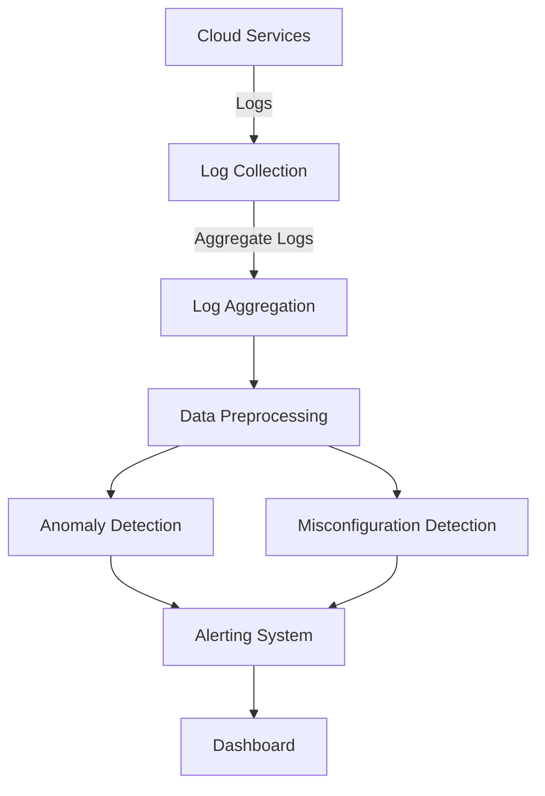

# About Log Guardian AI

In today's rapidly evolving digital landscape, maintaining the security and reliability of cloud infrastructure is paramount. 

Cloud environments are dynamic and complex, often involving numerous services, configurations, and integrations. Traditional monitoring solutions may fall short in proactively identifying issues, especially those arising from misconfigurations or subtle anomalies. 

This project aims to develop an AI-Powered Cloud Monitoring and Anomaly Detection System that leverages artificial intelligence to monitor cloud logs, detect anomalies, identify misconfigurations, and ensure the seamless operation of cloud services. By implementing this system, organizations can enhance their cloud security posture, reduce downtime, and streamline their operational workflows.

## Project Overview
This project aims to **automate the monitoring** of a cloud environment, with a focus on **detecting anomalies and misconfigurations** to prevent operational failures before they cause serious issues. The system helps improve **security, reliability**, and **efficiency** by continuously analyzing logs and configurations, sending **real-time alerts** when something goes wrong.

## Objectives

- **Proactive Monitoring**: Continuously monitor cloud logs and metrics to detect anomalies and misconfigurations before they escalate into critical issues.
- **Automated Detection**: Utilize AI/ML models to automatically identify unusual patterns and potential security threats.
- **Real-Time Alerts**: Implement a robust alerting mechanism to notify admins/stakeholders of detected issues promptly.
- **Comprehensive Reporting**: Generate detailed reports and dashboards for visibility into the cloud environment’s health and security.
- **Scalability and Flexibility**: Ensure the system can scale with the organization's cloud infrastructure and adapt to evolving monitoring needs.
- **Case Study Development**: Create a detailed case study showcasing the system's effectiveness in a real-world scenario.

## Key components and features

### Log monitoring and aggregation

- **Data sources**: Collect logs from various cloud services and platforms that provide raw data free to use for research purposes.
- **Log aggregation**: Centralize logs using services like AWS S3, AWS Kinesis, or Elasticsearch to facilitate efficient analysis.

### AI-Based anomaly detection

- **Machine Learning Models**: Implement models such as Isolation Forest, One-Class SVM, or Autoencoders to identify deviations from normal behavior.
- **Training Data**: Use historical log data to train models, ensuring they can recognize typical patterns and detect anomalies accurately.
- **Real-Time Analysis**: Deploy models using AWS SageMaker or Lambda for real-time log analysis and anomaly detection.

### Misconfigurations detection

- **Configuration Audits**: Periodically scan cloud resource configurations to identify misconfigurations like open S3 buckets, overly permissive IAM roles, or incorrect security group settings.
- **Rule-Based Checks**: Define specific rules and benchmarks (e.g., CIS benchmarks) to automate the detection of configuration issues.

### Alerting and notification system

- **AWS SNS Integration**: Use AWS Simple Notification Service (SNS) to send alerts via email, SMS, or other platforms like Teams.
- **Threshold-Based Alerts**: Configure alerts based on predefined thresholds for anomalies or misconfigurations.
- **Incident Prioritization**: Implement severity levels to prioritize alerts and ensure critical issues receive immediate attention.

### Dashboard and reporting

- **Visualization Tools**: Create interactive dashboards using Grafana, Kibana, or custom web applications built with Flask/FastAPI and visualization libraries like Plotly.
- **Real-Time Metrics**: Display real-time data on system health, detected anomalies, and misconfigurations.
- **Historical Analysis**: Provide historical data analysis to identify trends and recurring issues.

### Automated Remediation (Optional)

- **Self-Healing Scripts**: Develop scripts to automatically remediate certain types of misconfigurations or anomalies (e.g., closing an open security group).
- **Integration with CI/CD**: Incorporate automated remediation into the CI/CD pipeline for seamless issue resolution.

## System Architecture

## Feedback and support
Please report any issues, usability improvements, or feature requests to our
<a href="https://youtrack.jetbrains.com/newIssue?project=WRS">YouTrack project</a>
(you will need to register).

You are welcome to join our
<a href="https://jb.gg/WRS_Slack">public Slack workspace</a>.
Before you do, please read our [Code of conduct](https://plugins.jetbrains.com/plugin/20158-writerside/docs/writerside-code-of-conduct.html).
We assume that you’ve read and acknowledged it before joining.

You can also always email us at [writerside@jetbrains.com](mailto:writerside@jetbrains.com).

<seealso>
    <category ref="wrs">
        <a href="https://plugins.jetbrains.com/plugin/20158-writerside/docs/markup-reference.html">Markup reference</a>
        <a href="https://plugins.jetbrains.com/plugin/20158-writerside/docs/manage-table-of-contents.html">Reorder topics in the TOC</a>
        <a href="https://plugins.jetbrains.com/plugin/20158-writerside/docs/local-build.html">Build and publish</a>
        <a href="https://plugins.jetbrains.com/plugin/20158-writerside/docs/configure-search.html">Configure Search</a>
    </category>
</seealso>